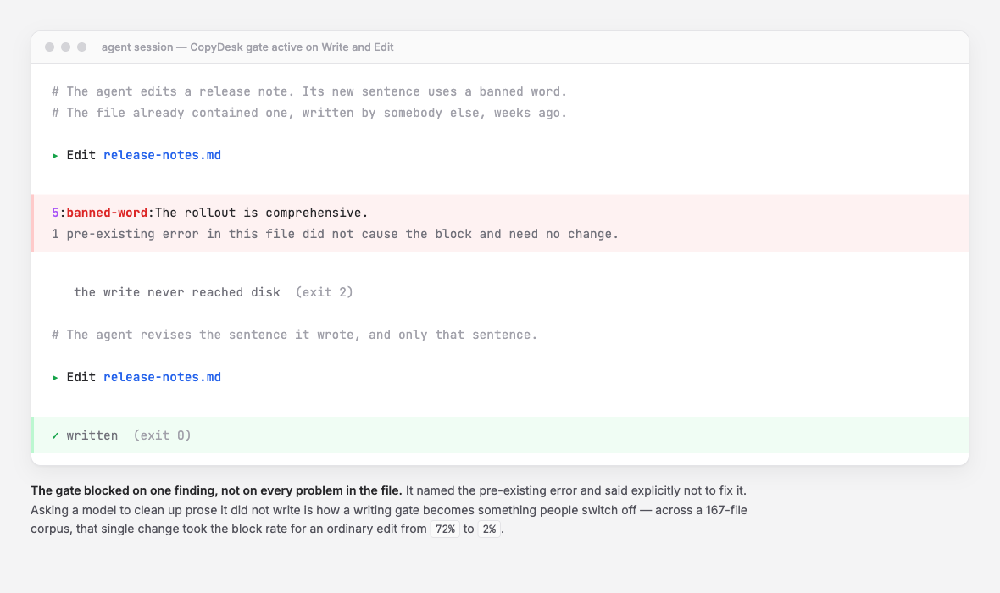

# CopyDesk

[](https://www.npmjs.com/package/copydesk)
[](https://github.com/carlosboeing/copydesk/actions/workflows/test.yml)
[](LICENSE)
[](https://www.python.org/downloads/)
[](docs/ROADMAP.md)

**A prose gate for AI coding agents.** It refuses the write, so the bad sentence never reaches the file.

Every other prose tool reads your text after it is written. CopyDesk sits one step earlier: it puts the rules in the model's context before it generates, and refuses the write if the model ignores them. No dependencies beyond the Python standard library.

---

## What it looks like

The part no other tool does happens when an agent tries to write. The gate refuses, and the agent revises before anything reaches your disk:

<picture>
  <source media="(prefers-color-scheme: dark)" srcset="docs/assets/gate-demo-dark.png">
  
</picture>

Two details there matter more than they look.

The gate blocked on **one** finding, not on every problem in the file. It reports the pre-existing error and explicitly says not to fix it. Asking a model to clean up prose it did not write is how a writing gate becomes something people switch off.

You can also use it as an ordinary linter, on files or standard input:

```console
$ copydesk check release-notes.md
release-notes.md:
3:announcing-opener:Great question — let me walk you through it. This release delivers a robust and
3:banned-word:Great question — let me walk you through it. This release delivers a robust and
3:sentence-length:This release delivers a robust and comprehensive overhaul of the export pipeline…
4:banned-word:comprehensive overhaul of the export pipeline, which is a testament to the team's
5:banned-word:work over the last quarter and showcases the intricate improvements we've made to
8:idiom:That said, we should circle back on the remaining items. As noted above, the
8:orphan-pointer:That said, we should circle back on the remaining items. As noted above, the
9:soft-offer:former approach is deprecated. Happy to walk through any of this if you'd like.
```

## Why this exists

AI agents write a great deal of prose: commit messages, pull request descriptions, documentation, release notes, and the running commentary in chat. Most of it has the same recognisable problems.

- Sentences run to forty words.
- Paragraphs never reach a point.
- Openers announce what is coming instead of saying it.
- A small vocabulary of words signals that a machine wrote this.

Existing tools catch that after the fact. [Vale](https://vale.sh) is excellent and runs in continuous integration, where a finding costs a round trip and someone's attention. [sloptrim](https://github.com/seyedehsanhadi/sloptrim) scores files after they are saved, where a finding costs a rewrite the model already committed to.

Neither can reach the two moments where correction is cheapest, because neither was built for a producer that has a context window.

**CopyDesk is.** It injects a short précis of the rules into the agent's context on every turn, so the text is often never generated. When it is generated anyway, the gate refuses the write and the agent gets one retry rather than a review comment three days later.

There is a second gap. Roughly half of an agent's prose is chat that never becomes a file at all, and a file linter cannot see any of it. Measured across [1.5 million words of transcripts](docs/evidence/observational-baseline.md), that chat carries **9.14 blocking violations per 1,000 words against 5.42 in documents**. The worse half is the half nobody was checking.

## Contents

- [Install](#install)
- [Usage](#usage)
- [Set up the gate](#set-up-the-gate)
- [Configuration](#configuration)
- [Rules](#rules)
- [How it compares](#how-it-compares)
- [Evidence](#evidence)
- [Project status](#project-status)
- [Contributing](#contributing)
- [Security](#security)
- [Licence and credits](#licence-and-credits)

## Install

```bash
npm install -g copydesk
```

Or run it without installing:

```bash
npx copydesk check README.md
```

Or from a checkout, which puts `copydesk` on your `PATH` and changes nothing else:

```bash
git clone https://github.com/carlosboeing/copydesk.git
cd copydesk
./install.sh
```

CopyDesk is a Python program distributed through npm, because npm never inspects the language of an executable it places on the path. It needs Python 3.9 or later and nothing else. There are no third-party packages to install, deliberately: the gate runs on every file an agent writes, so a slow import or a dependency conflict would be felt on every keystroke.

Verify the install at any time:

```bash
copydesk doctor
```

`doctor` prints the preset it resolved, the config files it found, where state is written, and whether the hooks are registered. It never changes anything.

## Usage

Check files, or standard input:

```bash
copydesk check docs/guide.md CHANGELOG.md
cat draft.md | copydesk check -
```

See what the gate has been doing:

```bash
copydesk stats                    # a summary of recent activity
copydesk stats --since 30d --json # machine-readable
copydesk report --out report.md   # a written report
```

Exit codes follow the usual convention:

| Code | Meaning |
|---:|---|
| `0` | clean, or warnings only |
| `1` | findings that would block a write |
| `2` | a hook refused the write |
| `64` | usage error |

## Set up the gate

The gate is the reason CopyDesk exists. It currently ships a verified adapter for [Claude Code](https://claude.com/claude-code); other harnesses are on the [roadmap](docs/ROADMAP.md).

Copy the hook, the linter and the rules into your hooks directory:

```bash
mkdir -p ~/.claude/hooks/copydesk/rules
cp hooks/gate.sh hooks/reminder.sh lib/linter.py ~/.claude/hooks/copydesk/
cp rules/plain-english.json ~/.claude/hooks/copydesk/rules/
chmod +x ~/.claude/hooks/copydesk/gate.sh ~/.claude/hooks/copydesk/reminder.sh
```

Then register both hooks in `~/.claude/settings.json`:

```json
{
  "hooks": {
    "PreToolUse": [
      {
        "matcher": "Write|Edit",
        "hooks": [{ "type": "command", "command": "~/.claude/hooks/copydesk/gate.sh" }]
      }
    ],
    "UserPromptSubmit": [
      {
        "hooks": [{ "type": "command", "command": "~/.claude/hooks/copydesk/reminder.sh" }]
      }
    ]
  }
}
```

`PreToolUse` is the gate that refuses writes. `UserPromptSubmit` is the 49-word précis that shapes the model before it writes anything, and it is the half that prevents rather than corrects.

Run `copydesk doctor` afterwards to confirm both are live.

Two things are worth knowing before you turn it on.

**The rules file must travel with `linter.py`.** The linter compiles its rules at import. A copy without one reports `PresetNotFound` and stops checking, rather than silently passing everything.

**The gate fails open, by design.** A malformed payload, an unreadable config or an internal error lets the write through and prints why. A hook that blocks your work because of its own misconfiguration is worse than no hook, so CopyDesk never does that. It is a writing-quality gate, not a security control.

## Configuration

Configuration is optional. With none, the built-in `plain-english` preset applies.

Two files are discovered and merged, rather than one overriding the other: a user file at `$XDG_CONFIG_HOME/copydesk/config.json`, and the nearest `copydesk.config.json` found walking up from the document being checked.

```json
{
  "version": 1,
  "extends": "plain-english",
  "rules": {
    "sentence-length": { "severity": "warn", "max": 30 },
    "banned-word": { "add": ["synergy"], "remove": ["robust"] },
    "unglossed-term": { "vocabulary": { "add": ["React", "Postgres"] } },
    "nested-table": { "severity": "off" }
  }
}
```

Every rule takes a `severity` of `error`, `warn` or `off`. Word lists take `add` and `remove` rather than replacement, so extending a preset never means restating it.

The project file wins over the user file. Your personal vocabulary should not quietly loosen the standard a repository publishes under.

Full detail, including every error case, is in [docs/configuration.md](docs/configuration.md).

## Rules

15 rules in three groups.

| Group | Example | How you change it |
|---|---|---|
| **Pattern** | `banned-word`, `idiom`, `soft-offer` | data — add and remove words |
| **Metric** | `sentence-length`, `paragraph-length` | code with exposed thresholds |
| **Structural** | `nested-table` | on or off |

Pattern rules live as data in `rules/plain-english.json`. Their shape deliberately matches Vale's `existence` check, which keeps a Vale importer cheap to build later. A token is an ordinary word, so adding one needs no regular expressions.

The rule worth singling out is **`unglossed-term`**. It flags a capitalised term the first time it appears with no gloss nearby, which is the failure a phrase-matching rule cannot see: the reader meets a name they have not been told the meaning of.

Full detection needs named-entity recognition, which is far beyond a regex linter. The workable version is a vocabulary you maintain, in three layers, because scope is the whole problem. "React" needs no gloss anywhere. Your own product name needs none inside its own repository and needs one in a blog post.

Every rule, parameter and default is listed in [docs/rules.md](docs/rules.md).

## How it compares

Correction gets more expensive as you move down this table.

| When | What happens | Who is there |
|---|---|---|
| Before generation | Rules enter the model's context, so the text is never produced | **CopyDesk** |
| At write time | The write is refused and the model must revise | **CopyDesk** |
| After the file is saved | The file is scored and a fix requested | sloptrim |
| In continuous integration | The build reports or fails | Vale |

The claim is about position, not about rule quality. Nobody else is standing in the first two rows.

**Where CopyDesk is behind**, and it is worth knowing before you install it:

- **Vale** has eleven rule extension points, markup-aware parsing across four markup languages, official Microsoft and Google style guide rule sets, and editor integrations. CopyDesk has none of that.
- **sloptrim** reads more than 20 file formats including `.docx` and `.epub`, against Markdown alone here. Its 0-100 score also reads more clearly to a newcomer than a pass-or-fail list.
- On raw pattern count the three are comparable: sloptrim carries 71 patterns, CopyDesk 67 tokens across 7 pattern rules.

CopyDesk will not win on breadth and does not try. Use Vale for a style guide in continuous integration. Use CopyDesk for the agent writing the text in the first place. They are not competing for the same slot.

## Evidence

Most claims about AI writing quality come with no numbers and no way to check them. These come with both, and the measurement scripts ship in `eval/`.

- **[Observational baseline](docs/evidence/observational-baseline.md)** — 1,556,107 words of chat and 626,153 words of Markdown from real sessions. It breaks the rate down per rule, and includes a control run that removes the sessions which designed the rules.
- **[Gate baseline](docs/evidence/baseline-results.md)** — two continuous ten-turn sessions recording model, effort, approval mode and a pinned target commit, measuring whether style decays across a long session. It does, and partially recovers.

## Project status

**`0.1.0`, pre-1.0 and in daily use by its author.** Expect the rules to be opinionated and the harness coverage to be thin. The command-line interface, the config schema and the rule identifiers are already frozen. A config you write today keeps working.

`1.0.0` is gated on one verifiable item rather than a date: a TypeScript implementation passing the Python test suite through `bin/copydesk`. The [roadmap](docs/ROADMAP.md) covers what comes between, and [CHANGELOG.md](CHANGELOG.md) covers what has shipped.

## Contributing

Issues and pull requests are welcome. The most useful contributions right now are bug reports with a document that reproduces the problem, and disagreements with a rule.

A rule that costs more than it catches is a defect. If something fires on prose you believe is fine, open an issue with the sentence.

```bash
python3 -m unittest discover tests/
```

See [CONTRIBUTING.md](CONTRIBUTING.md) for the test suite, the pre-commit hook and how to propose a rule change.

## Security

CopyDesk makes no network calls, and document content never leaves your machine. Telemetry is written locally and can be reduced or disabled with `COPYDESK_LOG_FLAGGED_TEXT=0` and `COPYDESK_LOG=0`.

To report a vulnerability, see [SECURITY.md](SECURITY.md).

## Licence and credits

MIT. See [LICENSE](LICENSE).

`lib/linter.py` is vendored and adapted from [`AminBlg/SimpleEnglish`](https://github.com/AminBlg/SimpleEnglish), also MIT. Its whitespace tokenizer, sentence splitter and exclusion approach are the foundation this is built on; the full notice travels in the file and in [LICENSE](LICENSE).

The casing convention comes from [CrossRev's ADR 0010](https://github.com/carlosboeing/crossrev/blob/main/docs/adrs/0010-name-crossrev.md), adopted unchanged.
